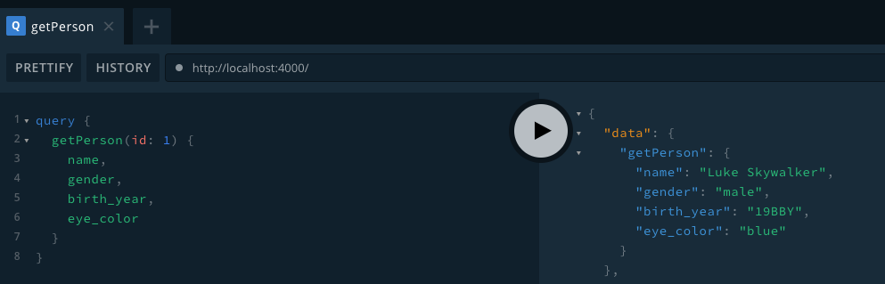

This is a walkthrough of how to expose 3rd party services using uStart. We are going to use [The Star Wars API](https://swapi.co) to create a GraphQL wrapper.

You can jump to the full example [here](https://github.com/ustart-dev/ustart-examples/tree/master/star-wars) or follow the step by step.

## Requirements

We take as reference the API created by [SWAPI-Wrapper](https://github.com/cfjedimaster/SWAPI-Wrapper). Our implementation is going to expose some of those methods as GraphQL queries.

* `getPerson(id)`: Returns a person.
* `getPeople(page, search)`: Returns all people, paged. Defaults to page 1.
* `getFilm(id)`: Returns one film.
* `getFilms(page, search)`: Returns all films, paged. Defaults to page 1.
* `getPlanet(id)`: Returns a planet.
* `getPlanets(page, search)`: Returns all planets, paged. Defaults to page 1.

> This example is going to query directly to [swapi.co](https://swapi.co). *SWAPI-Wrapper* is just a reference.

## Initializing

Initialize a new uStart project

```shell
mkdir star-wars && cd $_
npx ustart-cli@alpha init
```

Once it is ready, we have to install [axios](https://github.com/axios/axios) as dependency.

```shell
npm install axios
```

> `axios` is a promise based HTTP client for the browser and node.js. It help us to query `swapi.co`.

## Architecture

[PENDING] Schema (graphql) -> Resolver -> SWAPI

## First query

First, let's make it work with `People` API. Create the entity `People` at `src/entities`, then its schema and resolver:

* people.type.graphql
* people.resolvers.js

Below is the `people` schema with only root fields. We are going to add related fields -`films`, `homeworld` and `vehicles` - after. Only `getPerson` query is implemented in this step.

```graphql
type People {
  birth_year: String
  eye_color: String
  gender: String
  hair_color: String
  height: String
  mass: String
  name: String
  skin_color: String
  created: String
  edited: String
  url: String
}

type Query {
  getPerson(id: Int!): People
}
```

And now the resolver

```js
const axios = require('axios');

const peopleResolvers = {
  Query: {
    getPerson: (root, args) => {
      return axios.get(`https://swapi.co/api/people/${args.id}`).then(response => response.data);
    },
  }
};

export default peopleResolvers;
```

Start the server `npm run start`, then open your playground and send a query



We have tagged this step as ["first query"](https://github.com/ustart-dev/ustart-examples/releases/tag/first-query).

## People query

Soon...

## Films API

Soon...

## Planets API

Soon...
