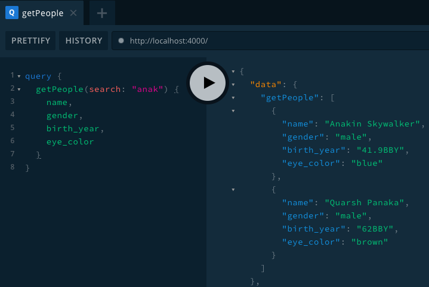
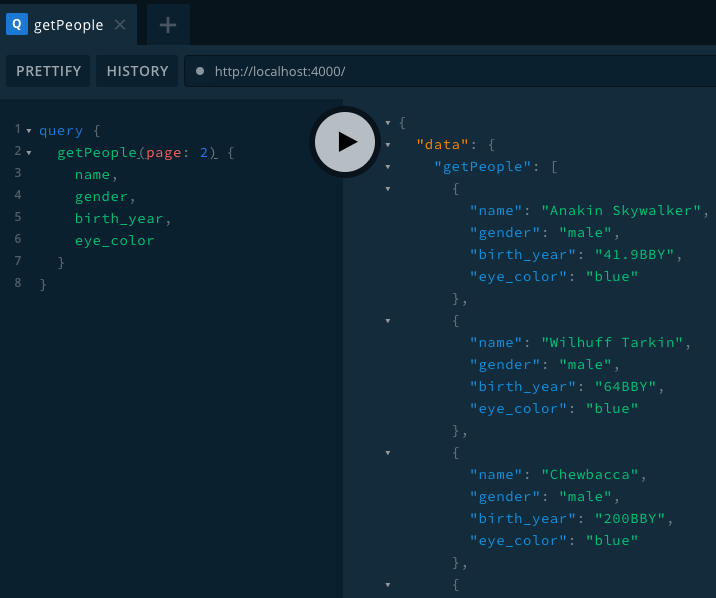
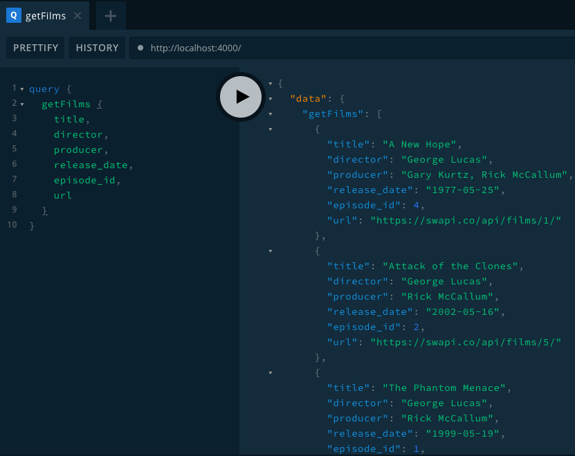
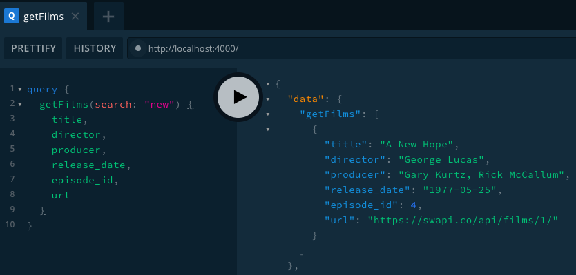
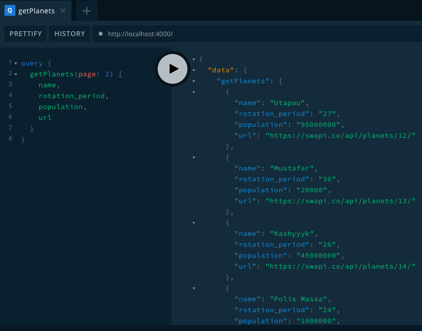

This is a walkthrough of how to expose 3rd party services using uStart. We are going to use [The Star Wars API](https://swapi.co) to create a GraphQL wrapper.

You can jump to the full example [here](https://github.com/ustart-dev/ustart-examples/tree/master/star-wars) or follow the step by step.

## Requirements

We take as reference the API created by [SWAPI-Wrapper](https://github.com/cfjedimaster/SWAPI-Wrapper). Our implementation is going to expose some of those methods as GraphQL queries.

* `getPerson(id)`: Returns a person.
* `getPeople(page, search)`: Returns all people, paged. Defaults to page 1.
* `getFilm(id)`: Returns one film.
* `getFilms(page, search)`: Returns all films, paged. Defaults to page 1.
* `getPlanet(id)`: Returns a planet.
* `getPlanets(page, search)`: Returns all planets, paged. Defaults to page 1.

> This example is going to query directly to [swapi.co](https://swapi.co). *SWAPI-Wrapper* is just a reference.

## Initializing

Initialize a new uStart project

```shell
mkdir star-wars && cd $_
npx ustart-cli@alpha init
```

Once it is ready, we have to install [axios](https://github.com/axios/axios) as dependency.

```shell
npm install axios
```

> `axios` is a promise based HTTP client for the browser and node.js. It help us to query `swapi.co`.

## Architecture

[PENDING] Schema (graphql) -> Resolver -> SWAPI

## First query

First, let's make it work with `People` API. Create the entity `People` at `src/entities`, then its schema and resolver:

* people.type.graphql
* people.resolvers.js

Below is the `people` schema with only root fields. We are going to add related fields -`films`, `homeworld` and `vehicles` - later. Only `getPerson` query is implemented in this step.

```graphql
type People {
  birth_year: String
  eye_color: String
  gender: String
  hair_color: String
  height: String
  mass: String
  name: String
  skin_color: String
  created: String
  edited: String
  url: String
}

type Query {
  getPerson(id: Int!): People
}
```

And now the resolver

```js
const axios = require('axios');

const peopleResolvers = {
  Query: {
    getPerson: (root, args) => {
      return axios.get(`https://swapi.co/api/people/${args.id}`).then(
        response => response.data
      );
    },
  }
};

export default peopleResolvers;
```

Start the server `npm run start`, then open your playground and send a query


You can download the full code of this step using the tag ["first-query"](https://github.com/ustart-dev/ustart-examples/releases/tag/first-query).

## People query

In the previous step we implemented our first query: `getPerson`. Now we are going to create `getPeople` query.

Open `people.type.graphql` file and add `getPeople(page: Int, search: String): [People]` inside of *Query* type

```graphql
type People {
  # ....
}

type Query {
  getPerson(id: Int!): People

  getPeople(page: Int, search: String): [People]
}
```

Open `people.resolvers.js` script and add the function `getPeople`

```js
const axios = require('axios');

const peopleResolvers = {
  Query: {
    getPerson: (root, args) => {
      return axios.get(`https://swapi.co/api/people/${args.id}`).then(
        response => response.data
      );
    },
    getPeople: (root, args) => {
      const params = {};

      if (args.page) {
        params.page = args.page;
      }

      if (args.search) {
        params.search = args.search;
      }

      return axios.get('https://swapi.co/api/people', { params }).then(
        response => response.data.results
      );
    },
  }
};

export default peopleResolvers;
```

Let's check if everything is ok. First, execute an empty query


Let's check if search works properly by searching for `anak`



Now, let's try pagination. Let's query for page 1 and page 2




It seems that everything works fine.

You can download the full code of this step using the tag ["people-query"](https://github.com/ustart-dev/ustart-examples/releases/tag/people-query).


## Films API

Films API have two queries: `getFilm(id)` and `getFilms(search)`. Their business logic is the same than `People` API.

Create the entity `Films` at `src/entities`, then its schema and resolver:

* films.type.graphql
* films.resolvers.js

Below is the `film` schema with only root fields. We are going to add related fields -`planets` and `vehicles`- later.

```graphql
type Film {
  title: String
  episode_id: Int
  opening_crawl: String
  director: String
  producer: String
  release_date: String
  created: String
  edited: String
  url: String
}

type Query {
  getFilm(id: Int!): Film
  getFilms(search: String): [Film]
}
```

And the resolver

```js
const axios = require('axios');

const filmResolvers = {
  Query: {
    getFilm: (root, args) => {
      return axios.get(`https://swapi.co/api/films/${args.id}`).then(
        response => response.data
      );
    },
    getFilms: (root, args) => {
      const params = {};

      if (args.search) {
        params.search = args.search;
      }

      return axios.get('https://swapi.co/api/films', { params }).then(
        response => response.data.results
      );
    },
  }
};

export default filmResolvers;
```

> `Films` API does not support pagination because there are few records.

Let's check if everything is ok. First, query the record with ID `1` to `getFilm` query


Let's continue with an empty query to `getFilms`



And finally a search for `new` term



It seems that everything works fine.

You can download the full code of this step using the tag ["films-api"](https://github.com/ustart-dev/ustart-examples/releases/tag/films-api).

## Planets API

Planets API have two queries: `getPlanet(id)` and `getPlanets(page, search)`. Their business logic is the same than rest of the API.

Create the entity `Planets` at `src/entities`, then its schema and resolver:

* planets.type.graphql
* planets.resolvers.js

Below is the `Planet` schema with only root fields. We are going to add related fields -`residents` and `films`- later.

```graphql
type Planet {
  name: String
  rotation_period: String
  orbital_period: String
  diameter: String
  climate: String
  gravity: String
  terrain: String
  surface_water: String
  population: String
  created: String
  edited: String
  url: String
}

type Query {
  getPlanet(id: Int!): Planet
  getPlanets(page: Int, search: String): [Planet]
}
```

And the resolver

```js
const axios = require('axios');

const planetResolvers = {
  Query: {
    getPlanet: (root, args) => {
      return axios.get(`https://swapi.co/api/planets/${args.id}`).then(
        response => response.data
      );
    },
    getPlanets: (root, args) => {
      const params = {};

      if (args.page) {
        params.page = args.page;
      }

      if (args.search) {
        params.search = args.search;
      }

      return axios.get('https://swapi.co/api/planets', { params }).then(
        response => response.data.results
      );
    },
  }
};

export default planetResolvers;
```

Let's check if everything is ok. First, query the record with ID `2` to `getPlanet` query


Let's continue with an empty query to `getPlanets`


Now, let's query the page 2



And finally a search for `tat` term


It seems that everything works fine.

You can download the full code of this step using the tag ["planets-api"](https://github.com/ustart-dev/ustart-examples/releases/tag/planets-api).

## Vehicles API

Vehicles API is the same than rest of the API. Try to code it yourself.

Anyway, you can download the full code of this step using the tag ["vehicles-api"](https://github.com/ustart-dev/ustart-examples/releases/tag/vehicles-api). Use it to compare your results!

## Adding related fields

One of the most powerful features of GraphQL is to include nested fields to retrieve related data.

Through the previous steps, we have left a few fields for later implementation. Now its time to make them work.

For example, the field `films` of `People` was not implemented. After this step, you could use it inside of a `getPerson` query to retrieve the `people` with id `1` and the films were it has participated.

```graphql
query getPerson(id: 1) {
  name,
  gender,
  films {
    title,
    episode_id,
    director
  }
}
```

We are going to show three implementations, the rest of them are on your own:

* `homeworld` from *People*. Returns a single *Planet*.
* `films` from *People*. Returns an array of *Film*.
* `vehicles` from *Films*. Returns an array of *Vehicle*.

Let's do it!

### homeworld

First, open both schema file and resolver script of *People* entity.

Add `homeworld: Planet` inside of *People* type at `people.type.graphql` file, as follow

```graphql
type People {
  #....
  homeworld: Planet
}
```

Add `People` field after *Query*, in the `people.resolvers.js` script, with the following implementation

```js
const peopleResolvers = {
  Query: {
    // ....
  },
  People: {
    homeworld(people) {
      console.log(people);
      return null;
    }
  }
};
```

Let's send the follow query to see what the console log shows

```graphql
query {
  getPerson(id: 1) {
    name,
    gender,
    url,
    homeworld {
      name,
      rotation_period,
      url
    }
  }
}
```


[The Star Wars API](https://swapi.co) returns the URL to the resources in all those related fields. We can take advantage of this and use it to make an `axios` call.

```js
const peopleResolvers = {
  Query: {
    // ....
  },
  People: {
    homeworld(people) {
      // console.log(people);
      // return null;
      return axios.get(people.homeworld).then(response => response.data);
    }
  }
};
```

Resend the query and...


Woohoo, it does work!

You can download the full code of this step using the tag ["people-homeworld"](https://github.com/ustart-dev/ustart-examples/releases/tag/people-homeworld).

### films

This case is a little different than `homeworld`. We have to return an array of data instead of a single result, thus we need to make several http queries (as many as the length of `people.films` array).

Add `films: [Film]` inside of *People* type at `people.type.graphql` file, as follow

```graphql
type People {
  #....
  films: [Film]
}
```

Add `films` function after *homeworld*, in the `people.resolvers.js` script, with the following implementation

```js
const peopleResolvers = {
  //...
  People: {
    homeworld(people) {
      //...
    },
    films(people) {
      console.log(people.films);
      return null;
    }
  }
};
```

Let's send the follow query to see what we get

```graphql
query {
  getPerson(id: 1) {
    name,
    gender,
    url,
    films {
      title,
      episode_id,
      director
    }
  }
}
```


We have received an array of films, as expected. Now we have to perform one *axios* request per each URLs.

In the resolver, add the follow implementation to `films(people)` function

```js
films(people) {
  // console.log(people.films);
  // return null;
  let promisesArr = people.films.map(f => axios.get(f));
  return Promise.all(promisesArr).then(res => res.map(r => r.data));
}
```

Resend the query and...


It works! We have receive a person, *Luke Skywalker* in this case, and all the films where he has participated.

You can download the full code of this step using the tag ["people-films"](https://github.com/ustart-dev/ustart-examples/releases/tag/people-films).

### vehicles

This case is the same than [films](3rd-party-services.md#films). We have to return an array of data instead of a single result, thus we need to make several http queries (as many as the length of `film.vehicles` array).

> By implementing this field we are going to able to make a three level query: `getPerson` -> `films` -> `vehicles`.

Open both schema file and resolver script of *Films* entity.

Add `vehicles: [Vehicle]` inside of *Film* type at `films.type.graphql` file, as follow

```graphql
type Film {
  #....
  vehicles: [Vehicle]
}
```

Add `Film` field after *Query*, in the `films.resolvers.js` script, with the following implementation

```js
const filmResolvers = {
  Query: {
    //...
  },
  Film: {
    vehicles(film) {
      console.log(film.vehicles);
      return null;
    }
  }
};
```

Let's send the follow query to see what we get

```graphql
query {
  getFilm(id: 1) {
    title,
    episode_id,
    director,
    vehicles {
      name,
      model,
      cargo_capacity
    }
  }
}
```


We have received an array of vehicles, as expected. Now we have to perform one *axios* request per each URLs.

In the resolver, add the follow implementation to `vehicles(film)` function

```js
vehicles(film) {
  // console.log(film.vehicles);
  // return null;
  let promisesArr = film.vehicles.map(v => axios.get(v));
  return Promise.all(promisesArr).then(res => res.map(r => r.data));
}
```

Resend the query and...


It works! We have received a film, *A New Hope* in this case, and all the vehicles that appeared.

Now, let's send a three level query

```graphql
query {
  getPerson(id: 1) {
    name,
    films {
      title,
      vehicles {
        name,
        model
      }
    }
  }
}
```

The playground output in two images (it is larger actually...)


Very good, everything just worked!

You can download the full code of this step using the tag ["films-vehicles"](https://github.com/ustart-dev/ustart-examples/releases/tag/films-vehicles).

## Conclusions

Soon...
