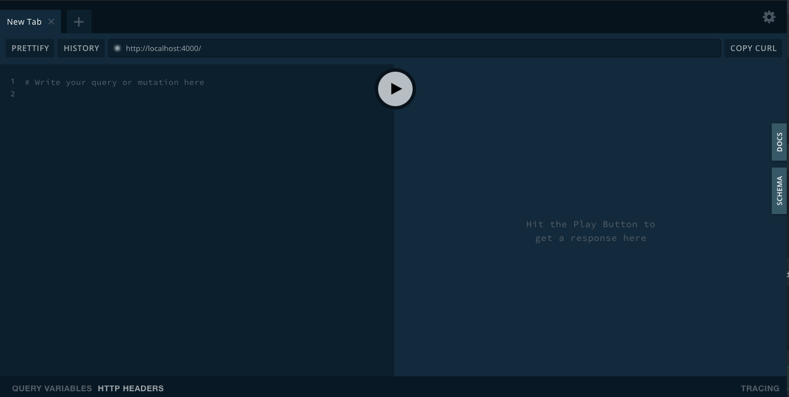

A [GraphQL](https://graphql.org) schema is at the core of any GraphQL server implementation. It describes the functionality available to the client applications that connect to it. Schemas are written using the GraphQL [Schema Definition Language (SDL)](https://www.prisma.io/blog/graphql-sdl-schema-definition-language-6755bcb9ce51). It is a simple and declarative way to talk to an API. You will always know what to ask for and what to expect.

## Types

The most basic components of a GraphQL schema are object types, which just represent a kind of object you can fetch from your service, and what fields it has. The follow example shows a type `Animal` with four attributes:

```graphql
type Animal {
  id: Int
  name: String
  age: Int
  category: String
}
```

## Queries

In GraphQL you fetch data by querying an API through the `query` type. The follow example shows a query called `getAnimal` that accepts the *id* argument and returns one animal:

```graphql
type Query {
  getAnimal(id: Int!): Animal
}
```

An execution of `getAnimal` in the [Playground](#playground) would look like:

```graphql
query {
  getAnimal(id: 8) {
    id,
    name,
    age,
    category
  }
}
```

And the response:
```json
{
  "data": {
    "getAnimal": {
      "id": 8,
      "name": "Sam",
      "age": 6,
      "category": "dog"
    }
  }
}
```

The follow example shows a query called `getAnimalsByName` that return an array of animals and receives one argument that can be used to filter the results:

```graphql
type Query {
  getAnimalsByName(name: String): [Animal]
}
```

## Mutations

In GraphQL you mutate data by using the `mutation` type. The follow example shows the mutation `addAnimal` that register one animal and returns it to the client. It accepts three arguments that will be sent to the server:

```graphql
type Mutation {
  addAnimal(
    name: String,
    age: Int,
    category: String
  ): Animal
}
```

In this case, the mutation did not receive the *id* field because it will be generated on the server.

## Subscription

Subscriptions allows you to subscribe to flows of data. They work similar to queries but with one difference, the server notifies you with changes every time data is available for you.

The follow example shows the subscription `getLatestAnimals` that returns the latest registered animals:

```graphql
type Subscription {
  getLatestAnimals: [Animal]
}
```

## Using schema

uStart automatically loads and merges all your graphql types defined inside of entities folder into one single schema. All your type files must follow the name convention `type.graphql` as a suffix.

In the case of `Animal` type, its schema file will be `animal.type.graphql` and saved into `src/entities/Animal` folder. A full example of the `Animal` type file:

```graphql
# file: src/entities/Animal/animal.type.graphql
type Animal {
  id: Int
  name: String
  age: Int
  category: String
}

type Query {
  # Returns an animal by its ID
  getAnimal(id: Int!): Animal

  # Returns a list of animals that matches name
  getAnimalsByName(name: String): [Animal]
}

type Mutation {
  # Register one animal and returns the record
  addAnimal(
    name: String,
    age: Int,
    category: String
  ): Animal
}

type Subscription {
  # Returns the latest registered animals
  getLatestAnimals: [Animal]
}
```

## Playground

The playground allows you to easily try your queries, mutations and subscriptions. It is a fast way to debug your schema while developing.

In development mode, the playground is started alongside with your backend at port *4000* by default. You can change this value by setting the [PORT](http://localhost:3000/docs/project-structure#env) environmental variable. Once your server is up and running, go to your browser and enter `http://localhost:400` (or whatever port you have set).



For production, disable the playground at the yoga config file:

```javascript
// file: your-project/config/yoga.js
exports.options = {
  port: parseInt(process.env.PORT, 10) || 4000,
  tracing: true,
  cacheControl: true,
  playground: process.env.NODE_ENV === "production" ? false : "/"
};
```
