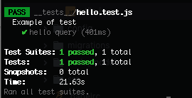

Testing allows you to ensure your application works the way you think it does, especially as your codebase changes over time. If you have good tests, you can refactor and rewrite code with confidence.

Automated testing is critical because it allows you to run a far greater set of tests much more often than you could manually, allowing you to catch regression errors immediately.

## Structure

uStart comes with [Jest](https://jestjs.io/docs/en/22.x/getting-started.html) as development dependency. We have also created a structure and included a test example for you.

 `__tests__` folder is the place to organize your test.

The directory tree after initialize a new project:

```
+-- your-app
|   +-- __tests__
|   |   +-- hello.test.js
|   |   +-- utils.js
```

## Jest configuration

The configuration file `jestSetup.js` is included in `config` folder. It includes:

* Initialization of `dotenv`.
* Injection of a `TestingUtils` object as global.

## Utility

We have included a script to help you write tests: `utils.js`. By default it exports `TestingUtils` class. It has a method to help you query your app. Feel free to customize it.

For instance, you can use it to:

* Add a method to get login clients
* Add recurring queries related to your project business logic.

## Running tests

You need to have a running instance of your app to run your test suite.

```shell
npm run test
```

The above use `jest` to run your test. To use a pattern to run one or few related tests:

```shell
npm run test users
```

## Example

A `hello` example is included every time you create a new project.

Create a new project. Let's name it `empty-example` and initialize it:

```shell
mkdir empty-example
cd empty-example
npx ustart-cli@alpha init
```

Start it:

```shell
npm run start
```

Open a new terminal, go to the new project and run:
```shell
npm run test
```



If your result matches the image, congratulations, you have done your first testing flow!.
